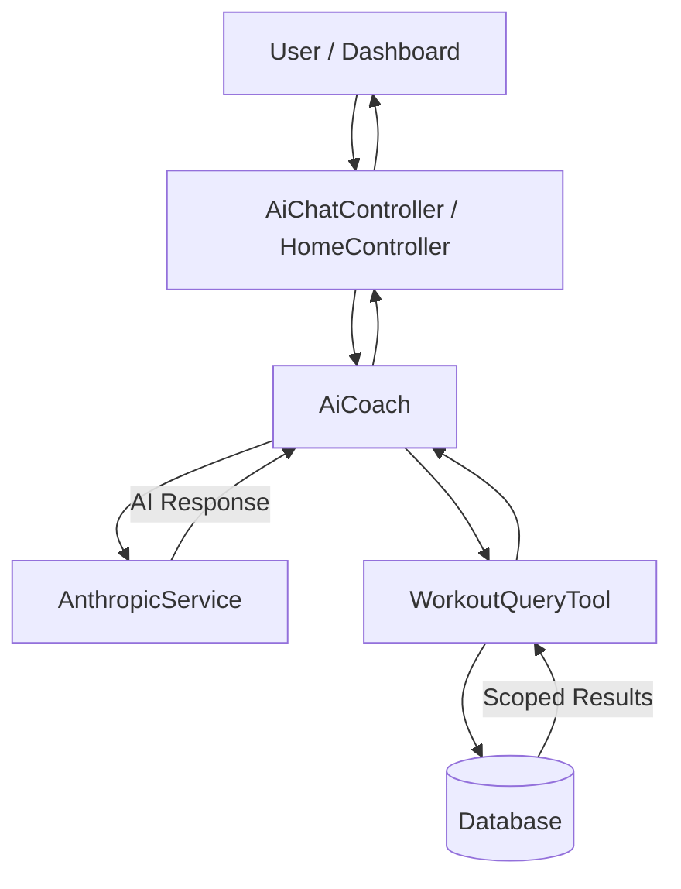

# AI Workout Recommendations

FitAndFocused integrates Claude 4.5 Sonnet to provide intelligent, contextual workout recommendations based on your training history. The system uses a feature-driven architecture that prioritizes security and modularity.

## Overview

The AI system analyzes your recent workout history and generates personalized daily workout recommendations with specific exercises, sets, reps, and form cues.

## Features

### 🎯 Daily Workout Recommendations
- **Contextual Analysis**: "Since you last trained [muscle group] on [date]..."
- **6 Detailed Exercises**: Each with sets, reps, and specific technique notes
- **Recovery-Aware**: Recommends muscle groups based on rest needs
- **Progressive Structure**: Heavy compounds → lighter isolation work

### 💬 AI Chat Assistant
- Ask questions about your workout history
- Get exercise form advice
- Receive motivation and coaching tips
- Context-aware responses based on current recommendation

## Architecture

The AI functionality is encapsulated in the `AiCoach` feature module (`app/Features/AiCoach/`), providing a clear separation between business logic, security, and the AI provider.

### Technical Flow



### Core Components

1.  **`AiCoach`** (`app/Features/AiCoach/AiCoach.php`): The primary orchestrator. It handles the high-level prompt engineering and manages the interaction loop between the AI and the database.
2.  **`WorkoutQueryTool`** (`app/Features/AiCoach/Tools/WorkoutQueryTool.php`): A dedicated security layer for database access. It enforces table whitelisting, prevents modifying queries, and automatically scopes all data access to the authenticated user.
3.  **`AnthropicService`** (`app/Services/AnthropicService.php`): A pure API wrapper for the Anthropic Claude API. It handles low-level HTTP communication and tool execution loops.

## API Integration

### Model
- **Name**: Claude 4.5 Sonnet
- **Provider**: Anthropic
- **Max Tokens**: 4096

### Security & Tool Use
The AI interacts with the database through the `query_database` tool provided by the `WorkoutQueryTool`.

**Security Guards:**
- **Read-Only**: Only `SELECT` statements are permitted.
- **Table Whitelisting**: The AI can only access `workouts`, `exercises`, `sets`, and `workout_exercises`.
- **Sensitive Data Blocking**: Access to `users`, `password_reset_tokens`, and other sensitive tables is strictly blocked at the tool level.
- **Automatic Scoping**: Every query is automatically modified to include `WHERE user_id = {auth_user_id}` before execution.

```php
[
    'name' => 'query_database',
    'description' => 'Execute a read-only SQL query against the workouts database.',
    'input_schema' => [
        'type' => 'object',
        'properties' => [
            'query' => [
                'type' => 'string',
                'description' => 'The SQL query to execute. MUST be a SELECT statement.'
            ]
        ],
        'required' => ['query']
    ]
]
```

## Recommendation Generation

### Workflow
1. `AiCoach` receives a request for a recommendation.
2. It constructs a system prompt defining the persona and output requirements.
3. The AI uses the `query_database` tool to fetch recent workout history.
4. `AiCoach` parses the final JSON response into a structured array.

### Output Format

```json
{
    "title": "Pull Day: Back & Biceps Power",
    "description": "Since you last trained chest and triceps on December 28th, today is perfect for a pull-focused session...",
    "exercises": [
        {
            "name": "Pull-ups or Lat Pulldown",
            "sets": "4",
            "reps": "6-10",
            "notes": "Wide grip for lat width. Control the negative for 2-3 seconds."
        }
    ]
}
```

## Usage

### Frontend (Home Page)

The recommendation is automatically displayed on the home page:

```tsx
<Home 
    recentWorkouts={workouts}
    stats={stats}
    recommendation={recommendation}  // AI-generated
/>
```

### Backend (Controller)

```php
use App\Features\AiCoach\AiCoach;

public function index(AiCoach $ai)
{
    $user = auth()->user();
    
    // Cached for 12 hours per user
    $recommendation = Cache::remember(
        "workout_recommendation_{$user->id}_" . now()->toDateString(),
        now()->addHours(12),
        fn() => $ai->generateRecommendation($user)
    );
    
    return Inertia::render('home', [
        'recommendation' => $recommendation
    ]);
}
```

### CLI Testing

Test recommendation generation without the frontend:

```bash
# Generate recommendation for user ID 2
php artisan ai:test-recommendation 2

# Output:
# ✅ Success!
# 
# Title: Pull Day: Back & Biceps Power
# 
# Description:
# Since you last trained chest and triceps on December 28th...
# 
# Exercises: 6
# 
# 1. Pull-ups or Lat Pulldown
#    Sets: 4, Reps: 6-10
#    Notes: Wide grip for lat width...
```

## Chat Functionality

### Endpoint
```
POST /ai/chat
```

### Request
```json
{
    "message": "What should I focus on today?",
    "context": {
        "title": "Pull Day: Back & Biceps Power",
        "description": "...",
        "exercises": [...]
    }
}
```

### Response
```json
{
    "response": "Based on your recent training, focus on pull movements today..."
}
```

## Configuration

### Environment Variables

Add to your `.env`:

```env
ANTHROPIC_API_KEY=your_api_key_here
```

## Caching Strategy

### Recommendation Cache
- **Key**: `workout_recommendation_{user_id}_{date}`
- **Duration**: 12 hours
- **Reason**: Minimize API calls, consistent recommendation per day

### Clear Cache
```bash
# Clear specific user's recommendation
php artisan cache:forget workout_recommendation_2_2026-01-11

# Clear all cache
php artisan cache:clear
```

## Error Handling

### Fallback Recommendations
If the AI service is unavailable or errors out, the system returns a graceful fallback message to ensure the dashboard remains functional.

### Logging
All AI-related interactions and errors are logged to `storage/logs/laravel.log`.

## Testing

### Automated Tests
```bash
# Test security and orchestration
php artisan test --filter=WorkoutQueryToolTest
php artisan test --filter=AiCoachTest
```

### Manual Testing
```bash
# Test via CLI
php artisan ai:test-recommendation 2

# Test via browser
# Navigate to http://fitandfocused.test/home
# View recommendation card

# Test chat
# Type in "Ask AI" input at bottom of screen
```

## Performance Considerations

### API Costs
- ~1000 tokens per recommendation generation
- Cached for 12 hours = max 2 calls/user/day
- Consider: 100 users × 2 calls = 200,000 tokens/day

### Response Time
- First load: 10-15 seconds (tool-use loop)
- Cached load: < 100ms
- Navigation timeout increased to handle AI processing

## Future Enhancements

- [ ] Voice input for chat
- [ ] Exercise variation suggestions based on equipment
- [ ] Progressive overload tracking (auto-suggest weight increases)
- [ ] Workout plan generation (multi-week programs)
- [ ] Exercise form video recommendations
- [ ] Nutrition recommendations based on training goals

---

**Last Updated:** January 15, 2026  
**AI Model:** Claude 4.5 Sonnet
